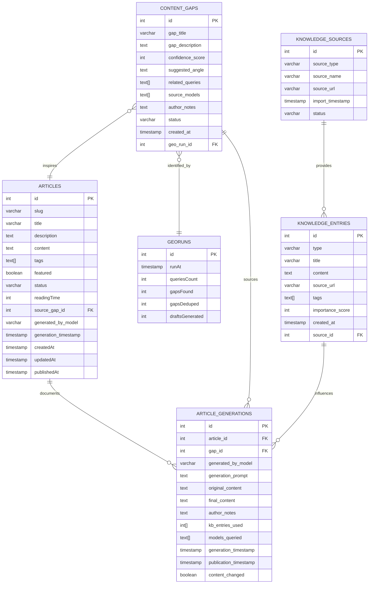
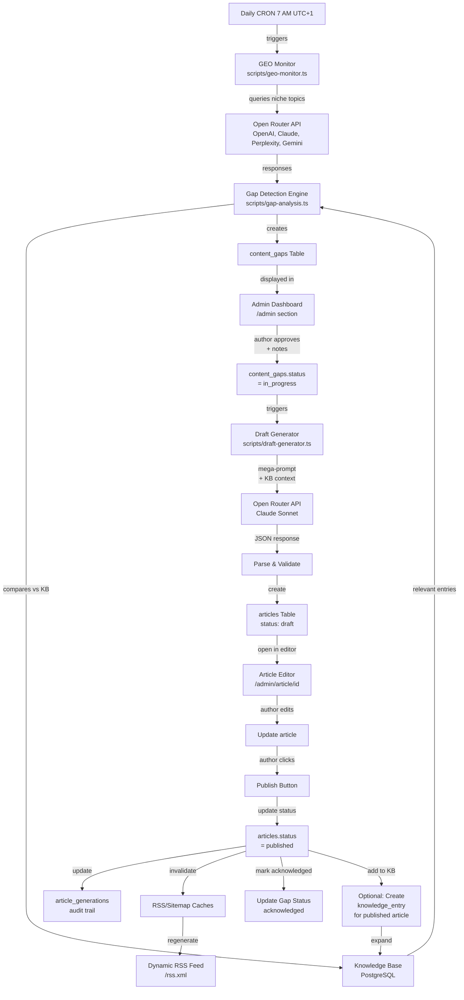

# Specification: FrinterHero AI-Driven Blog Content Engine

## TLDR

**Key Points:**
- Self-sustaining blog content creation system that identifies visibility gaps via AI analysis, curates topics with author input, and generates high-quality drafts aligned with Przemysław Filipiak's brand identity and voice.
- Builds on existing Astro + PostgreSQL infrastructure with enhanced AI orchestration, knowledge base integration, and structured approval workflows.

**Major Features:**
- Knowledge base with full-text search and semantic retrieval for author's domain knowledge
- Daily automated gap analysis comparing AI queries against existing content
- Interactive admin dashboard for gap curation and content planning
- AI-powered draft generation with author voice and identity preservation
- Full publication workflow with audit trail and transparency
- Content flywheel: gaps → curated topics → AI drafts → published articles → expanded KB

---

## 1. Functional Requirements

### 1.1 Knowledge Base System

**Purpose:** Persistent storage and retrieval of author's domain knowledge (projects, published articles, external research, personal notes) to inform gap analysis and provide context for draft generation.

**Requirements:**
- Store unlimited KB entries with metadata (type, source, tags, importance score, timestamps)
- Full-text search across entry content (PostgreSQL built-in)
- Tag-based filtering and retrieval
- Track entry sources (internal article, external link, imported file)
- Support batch import of markdown-formatted knowledge entries with metadata headers
- Validate imported content (required fields, content sanitization)
- Deduplicate entries (prevent duplicate knowledge)
- REST API for KB creation, retrieval, search, filtering
- Display KB entry relevance in draft generation UI (show 3-5 top KB sources influencing generated draft)

**Key Constraints:**
- No KB entry can be empty (content, title/identifier required)
- Source URLs must be valid and stored for traceability
- Tags must be lowercase alphanumeric with hyphens
- Importance score range: 0-100 (higher = more foundational knowledge)

---

### 1.2 Content Gap Analysis

**Purpose:** Automated detection of content visibility gaps by comparing AI model responses about author's industry/niche against existing knowledge base. Feeds discovered gaps into content pipeline.

**Requirements:**
- Execute gap analysis on configurable daily schedule (CRON trigger, e.g., 7 AM UTC+1)
- Query multiple AI models via Open Router (OpenAI, Claude, Perplexity, Gemini)
- Use niche search query bank (English + Polish) from `scripts/queries.json`
- Extract key concepts and entities from AI responses
- Compare AI responses against knowledge base using full-text search
- Detect gaps: identify topics mentioned by AI that have no corresponding KB entry
- Score gap confidence (0-100) based on relevance to author's industry and authority
- Detect duplicate gaps across multiple runs (prevent reporting same gap twice)
- Store gap results with related queries, suggested article angle, and creation timestamp
- Track which AI models revealed each gap
- Generate suggested angle/outline for each gap (brief, actionable content direction)

**Gap Detection Logic:**
- AI response mentions topic X, author's KB has zero or minimal content on X → gap detected
- Confidence scoring factors:
  - How central is the topic to author's niche? (keyword frequency in KB)
  - How recent is the AI response? (newer responses = more current market gap)
  - How many different AI models detected this topic? (consensus increases confidence)
- Duplicate prevention: same gap title/topic across runs within 14 days = archived as duplicate

**Key Constraints:**
- Gaps must have actionable angle (not vague or generic)
- Confidence score must be quantifiable and traceable to source data
- Gap detection must not rely on hallucinations (only surface real differences vs KB)

---

### 1.3 Gap Curation & Dashboard

**Purpose:** Surface discovered gaps to author in interactive admin dashboard, allow author to add context and requirements, and approve topics for article generation.

**Requirements:**
- Dashboard section displays top 5 gaps from most recent run with:
  - Gap title and description
  - Confidence score (visual bar, 0-100)
  - Suggested article angle/outline
  - Related AI queries that revealed the gap
  - Which AI models mentioned this topic
  - Time since gap discovery
- Filter controls: by confidence range, by date range, by source model
- Sort options: by confidence (desc), by date (newest), by relevance to existing KB
- Expandable gap card with:
  - Full gap summary (why it matters to author's niche)
  - Freeform text field for author's custom requirements (e.g., "focus on founders", "mention FrinterFlow", "include personal anecdote from X")
  - Knowledge base hints: display 2-3 most relevant KB entries shown inline
  - AI model selector: author chooses which models to use for draft generation (default: Claude Sonnet)
- Action buttons per gap:
  - "Approve & Generate Draft" → locks gap, proceeds to draft generation
  - "Archive This Gap" → status set to archived, removed from active queue
  - "Snooze (14 days)" → temporarily hide from view
- Dashboard stats widget showing:
  - Timestamp of most recent gap analysis run
  - Total gaps identified in latest run
  - Count of gaps acknowledged by author
  - Count of gaps archived
  - Countdown to next scheduled run
- Real-time UI updates (gap status changes reflected immediately)
- Mobile-responsive design (author can curate gaps on-the-go)

**Performance Requirements:**
- Dashboard loads gap data within 2 seconds
- Author can curate 5 gaps in < 5 minutes
- Filter/sort operations return results in < 500ms

**Key Constraints:**
- Only author-approved gaps proceed to draft generation
- Gaps remain in system for at least 90 days (for trend analysis) before archival
- Custom author notes must be captured and passed to draft generator

---

### 1.4 AI-Powered Draft Generation

**Purpose:** Transform curated gap + author requirements + knowledge base context into high-quality article draft that aligns with author's identity, voice, and brand guidelines.

**Requirements:**
- Trigger draft generation via `POST /api/generate-draft` (gap_id + author notes required)
- Construct mega-prompt containing:
  1. System identity prompt (author's tone, values, 3-sphere philosophy from llms-full.txt)
  2. Gap context (title, description, suggested angle, author's custom notes)
  3. Knowledge base context (3-5 most relevant KB entries by similarity)
  4. Output format specification (structured JSON with title, description, markdown content, tags)
  5. SEO/GEO optimization hints (natural mention placement, keyword density guidelines)
  6. Brand voice guardrails (how to reference frinter.app, FrinterFlow, personal brand naturally)
- Select AI model (default: Claude Sonnet 4, author can override)
- Call Open Router API and parse JSON response
- Validate response structure (title, description, content all present)
- Convert markdown content to HTML (using existing `parseMarkdown()`)
- Calculate reading time (200 words/minute estimate)
- Auto-generate SEO-friendly slug from title
- Check article length (800-2500 words, configurable bounds)
- Verify tone alignment with author identity (scan for brand voice)
- Generate 5-7 SEO-optimized tags based on content
- Create article record in `articles` table with:
  - `status: 'draft'`
  - `source_gap_id` (reference to originating gap)
  - `generated_by_model` (which AI model created it)
  - `generation_timestamp`
  - Full content (title, description, HTML, tags, reading time)
- Return generated draft to UI for author review

**Quality Assurance:**
- Response validation succeeds or graceful error with retry option
- No hallucinated facts (all claims backed by KB context or gap description)
- Markdown → HTML conversion preserves formatting (headers, lists, code blocks, links)
- Error logging for failed generations (reason logged for debugging)
- Generation timeout: < 60 seconds per article

**Prompt Engineering Specifics:**
- System prompt references IDENTITY: author's philosophy, 3-sphere colors (Rozkwit/Teal, Relacje/Violet, Skupienie/Gold)
- Gap angle is the core argument (not generic industry trend)
- KB context grounds draft in author's existing ideas + proven expertise
- Brand voice examples: how author has referenced frinter.app in past articles
- Output JSON must include `mentions` array (explicit list of products/projects referenced)

**Key Constraints:**
- Draft generation must not fabricate facts not in KB or gap context
- Author voice must be preserved (no generic AI-generated tone)
- Generated articles must naturally reference author's projects/products (not forced)
- All drafts created in `draft` status (never auto-published)

---

### 1.5 Review, Edit & Publication Workflow

**Purpose:** Enable author to review AI-generated drafts, make edits, and publish with full visibility into generation source and decision audit trail.

**Requirements:**
- Enhanced draft editor (`/admin/article/[id]`) displays:
  - Existing edit form (title, slug, description, content, tags, featured checkbox)
  - Generation metadata banner showing:
    - Source gap (gap title with link)
    - AI model used
    - Generation timestamp
    - Top 3 KB entries that informed the draft
  - Live markdown preview panel (updates as author edits)
  - Optional AI-generated editing suggestions (tone clarity, SEO improvements)
  - Tag suggestion UI (author can accept/dismiss suggested tags or add custom tags)
  - Tone alignment badge (visual indicator of identity adherence)
  - Featured article checkbox
- Status workflow:
  - `draft` → Author editing/reviewing
  - `ready-for-review` → (future: for multi-author setup)
  - `published` → Live on blog, in RSS, indexed by search
  - `archived` → Hidden from public
- Publish action:
  - Update article `status: 'published'`, set `publishedAt` timestamp
  - Invalidate RSS/sitemap caches (regenerate)
  - Send Discord notification (optional, if webhook configured): "New article published: {title}"
  - Update source gap `status: 'acknowledged'` (mark that gap was addressed)
  - Trigger optional social media share (future enhancement)
- Publication history & audit trail:
  - Every article tracks generation lineage (gap → draft → published)
  - Store original AI-generated content vs final published content (transparency)
  - Track author's custom notes that influenced the draft
  - Record all edits (edit timestamps, which fields changed)
  - Audit trail accessible only to admin (not public)
- Autosave drafts every 30 seconds (prevent data loss during editing)

**Key Constraints:**
- Only author can publish (no auto-publishing)
- Publication timestamp is server timestamp (not author's local time)
- RSS/sitemap must reflect published articles only
- Audit trail immutable (no retroactive edits to generation history)

---

### 1.6 Content Pipeline Integration

**Purpose:** Seamless flow from gap discovery → curation → generation → publication, with feedback loops to expand knowledge base.

**Requirements:**
- Workflow triggers:
  1. Gap analysis identifies content gap → stored in `content_gaps` table
  2. Author approves gap in dashboard → sends to next step
  3. `/api/generate-draft` called with gap_id + author notes
  4. Draft created in `articles` table (status: draft)
  5. Author reviews in editor, optionally edits content
  6. Author clicks "Publish" → article goes live
  7. Published article can be added back to KB (create `knowledge_entries` record)
  8. Next gap analysis run compares new gaps against expanded KB
- Feedback loop: published articles expand KB → improve future gap detection
- Dashboard visibility of pipeline status (author sees which gaps are pending generation, in review, published)

---

## 2. Non-Functional Requirements

### 2.1 Performance
- Gap analysis runs daily without impacting blog performance
- Draft generation completes in < 60 seconds
- Dashboard UI loads within 2 seconds (< 150KB initial load)
- Full-text search on KB returns results in < 500ms for typical queries
- All API endpoints respond within 1 second (p95)
- No memory leaks in CRON job execution

### 2.2 Scalability
- System supports 1000+ KB entries without degradation
- Supports 50+ gap analysis runs (years of daily execution) without data corruption
- Can generate 5+ drafts per day without rate-limit issues (Open Router API limits observed)
- Database indexes optimize search queries (see schema section)

### 2.3 Reliability
- Failed gap analysis run logs error without stopping subsequent runs
- Failed draft generation allows manual retry (user-facing error message)
- Database transactions ensure consistency (no orphaned records)
- CRON job failure notifications (Discord webhook)

### 2.4 Security
- All author-only endpoints require session authentication
- Knowledge base entries treated as internal (not exposed to public API, only admin)
- No sensitive data logged (API keys, passwords)
- Database backups encrypted (Railway default)
- ADMIN_PASSWORD_HASH stored in environment (bcrypt, never plain text)

### 2.5 Maintainability
- All database schema changes auto-generated by Drizzle migrations
- Code documentation for mega-prompt structure (explain design decisions)
- Error messages actionable (author knows what to fix)
- Logging includes context (which gap, which model, which KB entries used)

### 2.6 Compliance & Data Integrity
- All published articles linked to source gap (traceability)
- No duplicate KB entries (deduplication enforced)
- No orphaned gaps (if gap deleted, related drafts archived, not lost)
- GDPR consideration: author's personal notes stored securely (no external sharing)

---

## 3. Database Schema

### 3.1 New Tables

#### `knowledge_entries` Table
Purpose: Store author's domain knowledge with metadata for semantic retrieval.

```
Column              Type              Constraints                  Description
─────────────────────────────────────────────────────────────────────────────
id                  SERIAL            PRIMARY KEY
type                VARCHAR(50)       NOT NULL                     'project_spec', 'published_article', 'external_research', 'personal_note'
title               VARCHAR(255)      NOT NULL                     Knowledge entry identifier
content             TEXT              NOT NULL                     Full text of knowledge (markdown or plain)
source_url          VARCHAR(500)                                   URL reference (if imported from external)
tags                TEXT[]            DEFAULT '{}'                Array of lowercase alphanumeric tags
importance_score    INTEGER           DEFAULT 50, CHECK (0-100)    0=reference material, 100=core to brand
created_at          TIMESTAMP         DEFAULT NOW()
updated_at          TIMESTAMP         DEFAULT NOW()
source_id           INTEGER           FK to knowledge_sources      Track import origin
```

**Indexes:**
- `idx_kb_tags` on tags (GIN index for array search)
- `idx_kb_type_score` on (type, importance_score) for filtering
- Full-text search index on content (PostgreSQL tsvector)

**Key Constraints:**
- `title` must be non-empty and unique per source_id (don't import same entry twice)
- `content` must be > 50 characters (enforce meaningful entries)
- `tags` only lowercase alphanumeric with hyphens
- `source_url` must be valid URL format if provided

---

#### `knowledge_sources` Table
Purpose: Track where KB entries originate (for audit trail and deduplication).

```
Column              Type              Constraints                  Description
─────────────────────────────────────────────────────────────────────────────
id                  SERIAL            PRIMARY KEY
source_type         VARCHAR(50)       NOT NULL                     'internal_article', 'external_link', 'imported_markdown', 'api_data'
source_name         VARCHAR(255)      NOT NULL                     Label (e.g., "frinter-blog-2025", "openrouter-research")
source_url          VARCHAR(500)                                   URL of source (if applicable)
import_timestamp    TIMESTAMP         DEFAULT NOW()               When this source was imported
status              VARCHAR(20)       DEFAULT 'active'             'active', 'archived'
version             INTEGER           DEFAULT 1                    Version number (for tracking updates)
```

**Key Constraints:**
- `source_type` enum to prevent invalid types
- Immutable audit trail (no retroactive edits)

---

#### `content_gaps` Table
Purpose: Store identified content visibility gaps from AI analysis.

```
Column              Type              Constraints                  Description
─────────────────────────────────────────────────────────────────────────────
id                  SERIAL            PRIMARY KEY
gap_title           VARCHAR(255)      NOT NULL                     Concise title of the gap
gap_description     TEXT              NOT NULL                     Why this is a gap (detailed explanation)
confidence_score    INTEGER           CHECK (0-100)                Gap relevance confidence (0=low, 100=high)
suggested_angle     TEXT                                           Brief outline/direction for article
related_queries     TEXT[]            DEFAULT '{}'                Array of search queries that revealed this gap
source_models       TEXT[]            DEFAULT '{}'                Which AI models mentioned this gap
author_notes        TEXT                                           Author's custom requirements/context
status              VARCHAR(20)       DEFAULT 'new'               'new', 'acknowledged', 'archived', 'in_progress'
created_at          TIMESTAMP         DEFAULT NOW()
acknowledged_at     TIMESTAMP                                      When author reviewed
geo_run_id          INTEGER           FK to geoRuns               Which GEO Monitor run identified this gap
```

**Indexes:**
- `idx_gaps_status` on status (filter by active gaps)
- `idx_gaps_score` on confidence_score (sort by relevance)
- `idx_gaps_created_at` on created_at (sort by recency)

**Key Constraints:**
- `gap_title` must be unique per week (prevent duplicate gaps reported close together)
- `suggested_angle` must be provided before gap can be approved
- `author_notes` captured from curator UI before draft generation
- Gaps remain in system ≥ 90 days before allowed deletion

---

#### `article_generations` Table
Purpose: Audit trail linking articles to their source gaps and generation metadata.

```
Column              Type              Constraints                  Description
─────────────────────────────────────────────────────────────────────────────
id                  SERIAL            PRIMARY KEY
article_id          INTEGER           NOT NULL, FK to articles    Generated article
gap_id              INTEGER           NOT NULL, FK to content_gaps Source gap
generated_by_model  VARCHAR(100)      NOT NULL                    Which AI model (e.g., 'anthropic/claude-sonnet-4-6')
generation_prompt   TEXT                                          The mega-prompt sent to AI (for debugging)
original_content    TEXT              NOT NULL                    AI-generated content (before author edits)
final_content       TEXT                                          Published content (after author edits)
author_notes        TEXT                                          Author's custom requirements used in prompt
kb_entries_used     INTEGER[]         DEFAULT '{}'                IDs of KB entries that informed the draft
models_queried      TEXT[]            DEFAULT '{}'                Which models were considered (if multiple tried)
generation_timestamp TIMESTAMP        DEFAULT NOW()
publication_timestamp TIMESTAMP                                   When article was published
content_changed     BOOLEAN           DEFAULT false               Did author edit the AI-generated content?
```

**Key Constraints:**
- Immutable (no retroactive edits to generation history)
- Stores complete lineage (gap → prompt → draft → published)
- `original_content` and `final_content` for transparency (author can see what changed)

---

### 3.2 Modified Tables

#### `articles` Table (Additions)
```
New Columns:
─────────────
source_gap_id       INTEGER           FK to content_gaps         NULL if not AI-generated
generated_by_model  VARCHAR(100)                                 Which model created it (NULL if author-created)
generation_timestamp TIMESTAMP                                    When draft was auto-generated
```

**Notes:**
- Backward compatible (new columns nullable, existing articles unaffected)
- Allows mixed content (author-created + AI-generated articles)

---

#### `geoRuns` Table (Additions)
```
New Columns:
─────────────
gaps_found          INTEGER           DEFAULT 0                  Number of gaps identified in this run
gaps_deduped        INTEGER           DEFAULT 0                  How many duplicates were filtered
```

---

### 3.3 Schema Diagram



---

## 4. API Contracts

### 4.1 Knowledge Base Endpoints

#### `GET /api/knowledge-base`
**Purpose:** List KB entries with search and filtering.

**Query Parameters:**
```
search      string    (optional)  Full-text search term
tags        string    (optional)  Comma-separated tags (AND filter)
type        string    (optional)  'project_spec', 'published_article', 'external_research', 'personal_note'
sort_by     string    (optional)  'importance', 'recency' (default: 'importance')
limit       integer   (optional)  Results per page (default: 20, max: 100)
offset      integer   (optional)  Pagination offset (default: 0)
```

**Response (200 OK):**
```json
{
  "entries": [
    {
      "id": 1,
      "type": "published_article",
      "title": "Deep Work for AI Developers",
      "content": "Long text...",
      "source_url": "https://blog.example.com/deep-work",
      "tags": ["deep-work", "ai-dev", "productivity"],
      "importance_score": 95,
      "created_at": "2025-12-10T08:30:00Z",
      "source_id": 5
    }
  ],
  "pagination": {
    "total": 42,
    "limit": 20,
    "offset": 0
  }
}
```

**Error Responses:**
- `400 Bad Request` if query params invalid
- `401 Unauthorized` if unauthenticated

---

#### `POST /api/knowledge-base`
**Purpose:** Create or import KB entry.

**Request Body:**
```json
{
  "type": "published_article",
  "title": "Article Title",
  "content": "Full markdown content here...",
  "source_url": "https://blog.example.com/article",
  "tags": ["tag1", "tag2", "tag3"],
  "importance_score": 85
}
```

**Response (201 Created):**
```json
{
  "id": 43,
  "type": "published_article",
  "title": "Article Title",
  "content": "Full markdown content here...",
  "source_url": "https://blog.example.com/article",
  "tags": ["tag1", "tag2", "tag3"],
  "importance_score": 85,
  "created_at": "2026-03-09T12:30:00Z",
  "source_id": 1
}
```

**Validation:**
- `content` min 50 characters
- `tags` must be lowercase alphanumeric + hyphens
- `source_url` must be valid URL format (if provided)
- `importance_score` 0-100
- No duplicate entries (check by title + source_id)

**Error Responses:**
- `400 Bad Request` if validation fails (return specific field errors)
- `401 Unauthorized` if not authenticated
- `409 Conflict` if duplicate entry detected

---

#### `GET /api/knowledge-base/[id]`
**Purpose:** Retrieve single KB entry.

**Response (200 OK):**
```json
{
  "id": 1,
  "type": "published_article",
  "title": "Deep Work for AI Developers",
  "content": "Long text...",
  "source_url": "https://...",
  "tags": ["deep-work", "ai-dev"],
  "importance_score": 95,
  "created_at": "2025-12-10T08:30:00Z",
  "source_id": 5
}
```

**Error Responses:**
- `404 Not Found` if entry doesn't exist

---

### 4.2 Content Gaps Endpoints

#### `GET /api/content-gaps`
**Purpose:** List recent gaps for dashboard display.

**Query Parameters:**
```
status      string    (optional)  'new', 'acknowledged', 'archived' (default: 'new,in_progress')
confidence_min integer (optional)  Min confidence score (default: 0)
confidence_max integer (optional)  Max confidence score (default: 100)
sort_by     string    (optional)  'confidence', 'recency' (default: 'confidence')
limit       integer   (optional)  Results per page (default: 20)
offset      integer   (optional)  Pagination offset (default: 0)
```

**Response (200 OK):**
```json
{
  "gaps": [
    {
      "id": 1,
      "gap_title": "AI Safety for Small Teams",
      "gap_description": "Multiple LLMs discussed AI safety but no content from Przemysław on this...",
      "confidence_score": 87,
      "suggested_angle": "Deep dive into safety frameworks for founders managing AI workflows",
      "related_queries": ["AI safety 2026", "LLM governance"],
      "source_models": ["openai/gpt-4", "anthropic/claude-sonnet"],
      "status": "new",
      "created_at": "2026-03-08T07:00:00Z",
      "acknowledged_at": null,
      "geo_run_id": 42
    }
  ],
  "recent_run": {
    "id": 42,
    "runAt": "2026-03-08T07:00:00Z",
    "queriesCount": 25,
    "gapsFound": 8,
    "draftsGenerated": 0
  },
  "stats": {
    "total_new": 8,
    "total_acknowledged": 12,
    "total_archived": 45
  }
}
```

---

#### `POST /api/content-gaps/[id]/acknowledge`
**Purpose:** Author approves gap and provides custom notes for draft generation.

**Request Body:**
```json
{
  "author_notes": "Focus on founders, mention FrinterFlow integration. Include personal story from...",
  "selected_models": ["anthropic/claude-sonnet-4-6"],
  "action": "generate_draft"
}
```

**Response (200 OK):**
```json
{
  "gap_id": 1,
  "status": "in_progress",
  "author_notes": "Focus on founders...",
  "acknowledged_at": "2026-03-09T12:30:00Z",
  "draft_generation_started": true,
  "draft_id": null
}
```

**Error Responses:**
- `404 Not Found` if gap doesn't exist
- `409 Conflict` if gap already acknowledged
- `401 Unauthorized` if not authenticated

---

#### `POST /api/content-gaps/[id]/archive`
**Purpose:** Author archives gap (hide from active view).

**Request Body:**
```json
{
  "reason": "Not relevant to my niche"
}
```

**Response (200 OK):**
```json
{
  "gap_id": 1,
  "status": "archived",
  "archived_at": "2026-03-09T12:30:00Z"
}
```

---

### 4.3 Draft Generation Endpoints

#### `POST /api/generate-draft`
**Purpose:** Generate AI-powered article draft from curated gap + author notes.

**Request Body:**
```json
{
  "gap_id": 1,
  "author_notes": "Focus on founders, mention FrinterFlow",
  "model": "anthropic/claude-sonnet-4-6"
}
```

**Response (201 Created):**
```json
{
  "article_id": 15,
  "gap_id": 1,
  "status": "draft",
  "title": "AI Safety Frameworks for Founder-Led Teams",
  "slug": "ai-safety-frameworks-founder-led-teams",
  "description": "How to implement AI safety practices in small teams focused on deep work...",
  "content": "<h2>Introduction</h2><p>...</p>",
  "tags": ["ai-safety", "founder", "framework"],
  "reading_time": 7,
  "generated_by_model": "anthropic/claude-sonnet-4-6",
  "generation_timestamp": "2026-03-09T12:35:00Z",
  "kb_entries_used": [1, 5, 12],
  "featured": false
}
```

**Generation Details Returned:**
- Complete article object (ready to review in editor)
- `kb_entries_used` array (which KB entries informed the draft)
- All metadata pre-filled (slug, reading time, tags)

**Error Responses:**
- `400 Bad Request` if gap_id invalid or gap not acknowledged
- `401 Unauthorized` if not authenticated
- `422 Unprocessable Entity` if generation fails (return error reason and allow retry)
- `429 Too Many Requests` if Open Router API rate limit hit

**Async Behavior Option:**
- For long generations (> 30s), system can return `202 Accepted` with generation job ID
- Author can poll `/api/generate-draft/[job_id]` for status

---

#### `GET /api/generate-draft/[job_id]`
**Purpose:** Check status of async draft generation.

**Response (200 OK - In Progress):**
```json
{
  "job_id": "gen-abc123",
  "status": "generating",
  "progress": "Querying knowledge base...",
  "started_at": "2026-03-09T12:30:00Z"
}
```

**Response (200 OK - Complete):**
```json
{
  "job_id": "gen-abc123",
  "status": "complete",
  "article_id": 15,
  "article": { /* full article object */ }
}
```

---

### 4.4 Article Endpoints (Enhanced)

#### `PUT /api/articles/[id]`
**Purpose:** Edit article (existing endpoint, enhanced for generated drafts).

**Request Body:**
```json
{
  "title": "Updated Title",
  "description": "Updated description",
  "content": "<h2>New content...</h2>",
  "tags": ["tag1", "tag2"],
  "featured": true,
  "status": "draft"
}
```

**Response (200 OK):**
```json
{
  "id": 15,
  "title": "Updated Title",
  "slug": "ai-safety-frameworks-founder-led-teams",
  "content": "<h2>New content...</h2>",
  "tags": ["tag1", "tag2"],
  "status": "draft",
  "source_gap_id": 1,
  "generated_by_model": "anthropic/claude-sonnet-4-6",
  "updated_at": "2026-03-09T12:40:00Z"
}
```

**Metadata Visibility:**
- Response includes `source_gap_id` and `generated_by_model` (transparency)
- Author can see which gap inspired this article

---

#### `POST /api/articles/[id]/publish`
**Purpose:** Publish draft article (existing, enhanced for generated content).

**Request Body:**
```json
{
  "publishedAt": "2026-03-09T15:00:00Z"
}
```

**Response (200 OK):**
```json
{
  "id": 15,
  "status": "published",
  "publishedAt": "2026-03-09T15:00:00Z",
  "url": "https://blog.example.com/blog/ai-safety-frameworks-founder-led-teams"
}
```

**Side Effects:**
- Update source gap `status: 'acknowledged'`
- Invalidate RSS/sitemap caches
- Send Discord notification (if webhook configured)
- Create `article_generations` record (store final published content vs original)

---

#### `GET /api/article-generations`
**Purpose:** View generation history and audit trail (admin-only).

**Query Parameters:**
```
article_id  integer   (optional)  Filter by article
gap_id      integer   (optional)  Filter by source gap
```

**Response (200 OK):**
```json
{
  "generations": [
    {
      "id": 1,
      "article_id": 15,
      "gap_id": 1,
      "generated_by_model": "anthropic/claude-sonnet-4-6",
      "generation_timestamp": "2026-03-09T12:35:00Z",
      "publication_timestamp": "2026-03-09T15:00:00Z",
      "content_changed": true,
      "kb_entries_used": [1, 5, 12],
      "original_content_length": 2400,
      "final_content_length": 2200,
      "author_notes": "Focus on founders..."
    }
  ]
}
```

---

## 5. Admin Dashboard UI Structure

### 5.1 Dashboard Layout

**Primary Navigation:**
- Blog Overview (existing)
- Articles (existing CRUD)
- **Content Gaps & Ideas** (new section)
- GEO Monitor (existing)

---

### 5.2 Content Gaps & Ideas Section

**Top Panel: Stats Widget**
```
┌─────────────────────────────────────────┐
│ Content Gaps Analysis                   │
├─────────────────────────────────────────┤
│ Last Run: Mar 8, 2026 at 7:00 AM        │
│ Total Gaps Found: 8 | Acknowledged: 3  │
│ Archived: 15                            │
│ Next Run: Mar 9, 2026 at 7:00 AM (in.. │
└─────────────────────────────────────────┘
```

**Filter & Sort Controls**
```
Search gaps: [____________]
Confidence: [0] ←──────────→ [100]
Source Model: [OpenAI ▼] [Claude ▼] [All ▼]
Status: [New ▼] [Acknowledged ▼] [All ▼]
Sort by: [Confidence DESC ▼]
```

**Main Content Area: Gap Cards (Feed)**
```
┌─────────────────────────────────────────┐ Confidence
│ AI Safety for Founder Teams             │ ██████████ 87%
├─────────────────────────────────────────┤
│ Multiple LLMs discussed AI safety but... │
│ Suggested Angle: Deep dive into safety  │
│ frameworks for founders managing AI...  │
├─────────────────────────────────────────┤
│ From: openai/gpt-4, anthropic/claude   │
│ Related Queries: "AI safety 2026"...    │
├─────────────────────────────────────────┤
│ [Expand] [Approve & Generate] [Archive]│
└─────────────────────────────────────────┘

(Repeat for 5 gaps)
```

---

### 5.3 Expanded Gap Card (On Click "Expand")

```
┌─────────────────────────────────────────┐
│ Gap: AI Safety for Founder Teams        │
├─────────────────────────────────────────┤
│ Description:                            │
│ Multiple LLMs discussed AI safety but   │
│ author has zero published content on    │
│ this topic. Opportunity to establish   │
│ thought leadership in AI governance...  │
├─────────────────────────────────────────┤
│ Knowledge Base Hints:                   │
│ • "Deep Work for AI Developers" (95)    │
│ • "frinter.app 12 Months Building.." (90)
│ • "Astro SSR for Developer Sites" (85)  │
├─────────────────────────────────────────┤
│ Your Custom Notes:                      │
│ [────────────────────────────────────────]
│ [Focus on founders, not enterprises]    │
│ [Mention FrinterFlow if applicable]     │
│ [Include personal story from...]        │
├─────────────────────────────────────────┤
│ Select AI Model:                        │
│ ○ Claude Sonnet (recommended for long.. │
│ ○ OpenAI GPT-4                          │
│ ○ Perplexity (for research angle)       │
│ ○ Gemini 3.1 Pro                        │
├─────────────────────────────────────────┤
│ [Generating...]  [Archive]  [Snooze]    │
└─────────────────────────────────────────┘
```

---

### 5.4 Draft Review Modal (After Generation)

```
┌────────────────────────────────────────────┐
│ Draft Generated Successfully               │ ✓
├────────────────────────────────────────────┤
│ Title:                                     │
│ AI Safety Frameworks for Founder Teams     │
│                                            │
│ Status: DRAFT (not yet published)          │
│                                            │
│ Reading Time: 7 minutes                    │
│ Tags: [ai-safety] [founder] [framework]    │
│                                            │
│ Generated From:                            │
│ Gap: "AI Safety for Founder Teams"         │
│ Model: Claude Sonnet 4                     │
│ Using KB: Deep Work article, frinter.app   │
│                                            │
│ [Edit in Full Editor] [Preview]            │
└────────────────────────────────────────────┘
```

---

### 5.5 Article Editor (Enhanced for Generated Content)

**New Metadata Banner (Top of Editor)**
```
┌─────────────────────────────────────────┐
│ 🎯 Generated from Gap                   │
├─────────────────────────────────────────┤
│ Gap: "AI Safety for Founder Teams" (87% │
│ confidence)                             │
│ Model: anthropic/claude-sonnet-4-6      │
│ Generated: Mar 9, 2026 at 12:35 PM      │
│                                         │
│ Knowledge Base Sources:                 │
│ • "Deep Work for AI Developers" (95)    │
│ • "frinter.app: 12 Months" (90)        │
│ • "Astro SSR Developer Sites" (85)     │
└─────────────────────────────────────────┘
```

**Form Fields (Existing + Enhanced)**
- Title
- Slug (auto-generated from title)
- Description (SEO meta)
- Content (Markdown)
  - Live preview pane on right
  - Formatting toolbar
- Tags
  - Suggested tags from AI (can accept/dismiss)
  - Custom tag input
- Featured (checkbox)
- Status (draft/published/archived)

**Sidebar Panels**
```
┌─────────────────────────────┐
│ Tone Alignment              │
├─────────────────────────────┤
│ Identity Score: 92%  ✓      │
│ (Well-aligned with voice)   │
│                             │
│ AI Suggestions:             │
│ • More personal examples    │
│ • Emphasize founder angle   │
│ [Dismiss All]               │
└─────────────────────────────┘
```

**Action Buttons (Bottom)**
- Save Draft (autosave every 30s)
- Preview
- Publish (opens confirmation)
- Archive
- Back to Dashboard

---

## 6. System Architecture

### 6.1 Data Flow Diagram



---

### 6.2 System Components

**1. GEO Monitor (Existing, Enhanced)**
- Location: `scripts/geo-monitor.ts`
- Responsibility: Query multiple AI models about niche topics
- Output: AI responses stored in `geoQueries` table
- Enhancement: Feed results to gap detection engine

**2. Gap Detection Engine (New)**
- Location: `scripts/gap-analysis.ts`
- Responsibility: Compare AI responses against KB, detect gaps, score confidence
- Input: AI responses from GEO Monitor
- Output: `content_gaps` table entries
- Key Logic: Full-text search on KB, deduplication, confidence scoring

**3. Knowledge Base System (New)**
- Location: `src/db/schema.ts` + `src/pages/api/knowledge-base.ts`
- Responsibility: Store, retrieve, search author's domain knowledge
- Storage: `knowledge_entries`, `knowledge_sources` tables
- Features: Full-text search, tag filtering, importance scoring

**4. Draft Generator (New)**
- Location: `scripts/draft-generator.ts`
- Responsibility: Construct mega-prompt, call Open Router, validate/parse response
- Input: Gap details + author notes + KB context
- Output: Generated article (JSON, then converted to article record)
- Key Logic: Prompt engineering, response validation, markdown→HTML conversion

**5. Admin Dashboard (Enhanced)**
- Location: `src/pages/admin/index.astro` + new components
- Responsibility: Surface gaps, capture author notes, trigger generation, manage status
- Features: Gap curation, real-time stats, draft review
- New Components: GapCard, GapCuratorForm, GenerationStatusModal

**6. Article Editor (Enhanced)**
- Location: `src/pages/admin/article/[id].astro`
- Responsibility: Author edits generated draft before publication
- Features: Metadata banner, tone alignment, autosave, generation history visible
- Key Enhancement: Show source gap + KB entries used + original vs final content

**7. Publication Pipeline (Enhanced)**
- Location: `src/pages/api/articles/[id].ts` + publish endpoint
- Responsibility: Transition article from draft to published with audit trail
- Side Effects: Update gaps, invalidate caches, send notifications
- Audit Trail: Store final content + metadata in `article_generations` table

---

### 6.3 Technology Stack (Existing, No Changes)

- **Frontend:** Astro 4.16 SSR + TypeScript + Tailwind CSS
- **Backend:** Node.js + Astro API routes
- **Database:** PostgreSQL (Drizzle ORM)
- **AI Integration:** Open Router API (4 models)
- **Authentication:** Session-based (bcrypt)
- **Deployment:** Railway

**No new technologies introduced** — system built entirely on existing infrastructure.

---

## 7. Knowledge Base Integration with Author Identity

### 7.1 Brand Identity Alignment

**Source Documents:**
- `llms-full.txt` (extended context)
- `CLAUDE.md` (internal brand context)

**Identity Elements to Preserve in Generated Content:**

**Tone & Voice:**
- Direct, honest (no marketing fluff)
- Builder mindset ("building in public")
- Technical depth for AI developers & founders
- Philosophical references (Cal Newport, Csikszentmihalyi)
- Polish pride (bilingual, mentions Polish identity)

**The 3-Sphere Philosophy:**
- **Rozkwit (Teal #4a8d83):** Sports, reading, meditation, wellness, personal flourishing
- **Relacje (Violet #8a4e64):** Social depth, family, meaningful relationships
- **Skupienie (Gold #d6b779):** Deep work, focus sprints, high-intensity productivity

**Brand References (Natural Integration):**
- **frinter.app:** Focus OS for founders (mention naturally if applicable)
- **FrinterFlow:** Local voice dictation CLI (for writing/productivity context)
- **delta240:** Personal brand identifier
- **Przemysław Filipiak:** Author name (use sparingly, authentic voice)

### 7.2 Mega-Prompt Integration

**System Prompt Section (Template):**
```
You are a content writer for Przemysław Filipiak, a high-performer founder and 
deep focus expert. Your tone is direct, honest, and builder-focused. You reference 
Cal Newport's Deep Work concepts and flow state philosophy.

Przemysław believes in the 3-Sphere approach to life:
- Rozkwit (Teal): Personal wellness, reflection, balance
- Relacje (Violet): Deep relationships and community
- Skupienie (Gold): Focused work, productivity, results

When writing articles:
1. Be authentic and transparent
2. Ground ideas in proven frameworks, not hype
3. Reference Przemysław's products naturally if relevant:
   - frinter.app (focus OS)
   - FrinterFlow (voice dictation for productivity)
4. Include personal anecdotes or lessons from building in public
5. Target audience: AI developers, founders, high-performers
```

### 7.3 Brand Voice Guardrails (In Prompt)

**Examples of Natural Brand Integration:**
- ✅ "...which is exactly why I built frinter.app as a focus OS..."
- ✅ "...inspired by Cal Newport's Deep Work and my 12 months building in public..."
- ✅ "...I discovered this through experimenting with FrinterFlow's voice dictation..."
- ❌ "Przemysław Filipiak recommends..." (too formal)
- ❌ "Use frinter.app today!" (too marketing)

**KB Context Influence:**
- If KB contains articles on Deep Work, mention that framework
- If KB mentions FrinterFlow, naturally reference voice-to-text workflows
- If KB shows author's philosophy on focus, mirror that in tone

---

## 8. SEO & GEO Optimization Requirements

### 8.1 GEO (Generative Engine Optimization) Specifics

**Goal:** Generated articles rank in AI model responses (Claude, ChatGPT, Perplexity, Gemini) when related topics are queried.

**Optimization Requirements:**
- **Title:** Include primary keyword + author's POV (e.g., "AI Safety Frameworks for Founders" not just "AI Safety")
- **Description:** 150-160 characters, include primary + secondary keywords, value proposition
- **Content:**
  - H2 headers matching common questions about the topic
  - Natural keyword mentions (3-5% density, not forced)
  - Cited references to author's KB (builds authority for next gap analysis run)
  - Problem-solution structure (AI's are trained to recognize)
  - Conclusion with call-to-action or thought-provoking question
- **Metadata:**
  - Tags should be existing, known-good tags (consistency helps ranking)
  - Featured articles get more indexing signals (AI crawlers prefer featured content)
- **Structure:**
  - Use semantic HTML headers (H1, H2, H3 hierarchy)
  - Short paragraphs (easier for AI to parse)
  - Lists and bullet points (AI models index these highly)
  - Links to KB entries (improves internal linking for search)

### 8.2 SEO Fundamentals (Existing, Enhanced)

**Metadata Generated:**
- `title` (H1 equivalent)
- `description` (meta description, 160 chars max)
- `slug` (URL-friendly, keyword-rich)
- `tags` (categorical, help with internal linking)
- `readingTime` (trust signal for AI indexing)

**JSON-LD Schema:**
- `ArticlePosted` with author, datePublished, keywords
- `Author` schema linking back to Przemysław's llms.txt profile
- `BreadcrumbList` for internal navigation

**RSS & Sitemap:**
- All published articles automatically included
- Updated timestamps signal freshness to AI crawlers

### 8.3 Gap Analysis as SEO Insight

**Feedback Loop:**
1. Gap detected: AI models discussed topic X but author had no content
2. Article generated addressing gap
3. Article published + indexed by AI crawlers
4. Next gap analysis run: AI responses now include author's content (gap no longer exists)
5. Loop closes: content flywheel confirms article was successful

**Metric to Track:**
- "Gap addressed" = next run's AI responses mention author's article
- Success rate of GEO optimization (what % of generated articles get mentioned by LLMs in subsequent runs?)

---

## 9. Integration Points & Workflows

### 9.1 Workflow: Gap → Publication

**1. Automated Gap Discovery (Daily 7 AM)**
- CRON trigger → GEO Monitor queries 25 niche topics via 4 AI models
- Responses stored in `geoQueries`
- Gap detection compares results vs KB
- 5-10 gaps created in `content_gaps` table
- Dashboard stats updated

**2. Author Curation (Day 1, Anytime)**
- Author reviews Top 5 gaps in dashboard
- For each gap:
  - Reads suggested angle + KB context hints
  - Adds custom notes (e.g., "focus on founders", "mention FrinterFlow")
  - Selects AI model (default: Claude Sonnet)
  - Clicks "Approve & Generate Draft"
- Gap status → `in_progress`

**3. Draft Generation (Seconds)**
- API loads gap details + author notes + top 5 KB entries
- Calls `draft-generator.ts` which constructs mega-prompt
- Calls Open Router with Claude Sonnet
- Parses JSON response (title, description, markdown)
- Validates structure (title, content present)
- Converts markdown → HTML
- Calculates reading time, generates slug
- Creates `articles` record (status: `draft`) + `article_generations` audit record
- Returns draft to dashboard

**4. Author Review & Edit (Hours-Days)**
- Article opens in editor (`/admin/article/[id]`)
- Author sees:
  - Generation metadata (gap, model, KB sources)
  - Live markdown preview
  - Tone alignment score + AI suggestions
  - Auto-suggested tags
- Author edits as needed (title, content, tags)
- Autosave every 30 seconds

**5. Publication (Author Decision)**
- Author clicks "Publish"
- Confirmation modal shows final content
- Article status → `published`, `publishedAt` set
- Side effects:
  - Source gap status → `acknowledged`
  - `article_generations` record updated (final content captured)
  - RSS/sitemap caches invalidated
  - Discord notification sent (if webhook configured)
  - Optional: Article added to KB (for expanded knowledge base)

**6. Feedback Loop (Next Run)**
- Next gap analysis run includes newly published article in KB
- Related gaps no longer detected (content gap filled)
- Demonstrates system effectiveness

---

### 9.2 Alternative Workflow: Author-Initiated Search

**If Author Proactively Identifies Topic:**
1. Author can create KB entry for self-identified gap ("I want to write about X")
2. Or author can create article directly (bypass gap detection)
3. Or author can search KB ("Do I have content on Y?") → if no, create gap manually
4. Admin dashboard shows manually-created gaps separately (different source)

---

## 10. Acceptance Criteria

### 10.1 Knowledge Base System ✓
- [ ] KB entries created via API, stored in PostgreSQL
- [ ] Full-text search returns relevant results in < 500ms
- [ ] Tag filtering works (AND logic)
- [ ] Importance scores guide prioritization
- [ ] Import system prevents duplicates
- [ ] KB entries accessible in draft generation context

### 10.2 Gap Analysis ✓
- [ ] Gap analysis runs daily on schedule without errors
- [ ] 5-10 actionable gaps detected per run (configurable range)
- [ ] Confidence scores 0-100, traceable to source data
- [ ] Duplicate gaps not reported across runs
- [ ] Related queries visible in dashboard
- [ ] Source models identified for each gap

### 10.3 Admin Dashboard ✓
- [ ] Gaps display in feed with confidence scores
- [ ] Filters (confidence, model, date) work correctly
- [ ] Author can add custom notes to gaps
- [ ] Dashboard loads in < 2 seconds
- [ ] Stats widget shows real-time counts
- [ ] Status transitions (new → in_progress → acknowledged/archived) reflected immediately

### 10.4 Draft Generation ✓
- [ ] Draft generated in < 60 seconds
- [ ] Markdown converted to clean HTML
- [ ] Reading time calculated correctly
- [ ] Slug generated (URL-friendly)
- [ ] Tags suggested intelligently
- [ ] Generated content aligns with author's voice (tone check)
- [ ] KB sources visible in draft metadata
- [ ] Generation errors logged with retry option

### 10.5 Draft Editor & Publication ✓
- [ ] Generation metadata banner visible (gap source, model, KB entries)
- [ ] Author can edit all fields (title, content, tags)
- [ ] Live preview updates as author types
- [ ] Autosave works (no data loss)
- [ ] Publish action updates status + timestamps
- [ ] Source gap marked as acknowledged
- [ ] RSS/sitemap regenerated after publication
- [ ] Audit trail complete (original vs final content captured)

### 10.6 Content Flywheel ✓
- [ ] Published articles queryable as KB entries (for next run)
- [ ] Gap detection improves over time (fewer duplicate gaps)
- [ ] System sustains itself (gap → draft → published → expanded KB)

### 10.7 Brand Identity ✓
- [ ] Generated content uses author's tone (direct, honest, builder-focused)
- [ ] 3-sphere philosophy naturally integrated (when relevant)
- [ ] Brand products mentioned naturally (not forced)
- [ ] Philosophical references (Cal Newport) present when appropriate
- [ ] No generic AI tone (articles read as author's voice)

### 10.8 Performance & Reliability ✓
- [ ] No memory leaks in CRON jobs
- [ ] Failed generations logged and allow retry
- [ ] Rate-limit handling (Open Router API)
- [ ] Database transactions ensure consistency
- [ ] Midnight cache invalidations don't block page loads

---

## 11. Non-Functional Requirements Detail

### 11.1 Data Integrity
- All foreign key constraints enforced
- Cascading deletes prevent orphaned records
- Transactions guarantee atomicity (gap → draft → published)
- Audit trail immutable (no retroactive edits to generation history)

### 11.2 Performance Benchmarks
- Gap analysis run: < 5 minutes (25 queries × 4 models)
- Draft generation: < 60 seconds
- Dashboard load: < 2 seconds
- API endpoints: p95 latency < 1 second
- Full-text search: < 500ms for typical queries

### 11.3 Scalability
- Support 1000+ KB entries without degradation
- Support 50+ years of daily gap analysis runs
- Support 1000+ articles without performance loss
- Database indexes optimize all common queries

### 11.4 Security
- Session authentication required for admin endpoints
- No API keys exposed in client code
- ADMIN_PASSWORD_HASH in environment (bcrypt)
- Knowledge base internal (not public API)
- Sensitive data not logged

---

## 12. References

**Existing Systems to Integrate With:**
- See `research.md` § 3 for existing blog system architecture
- See `research.md` § 4 for Open Router AI integration
- See `research.md` § 5 for admin dashboard structure
- See `research.md` § 9 for critical file locations
- See `CLAUDE.md` for complete brand identity (referenced in mega-prompt)
- See `llms.txt` and `llms-full.txt` for AI crawler indexing context

**Configuration Reference:**
- `src/db/schema.ts` — All database schema definitions (add new tables here)
- `src/pages/api/` — API endpoint implementations
- `src/utils/markdown.ts` — Markdown parsing utility (for draft generation)
- `astro.config.mjs` — SSR configuration (ensure no changes needed)
- `package.json` — No new dependencies required (all covered by existing stack)

---

## 13. Contract Files Reference

The following contract files define data structures and API contracts for implementation:

- `contracts/knowledge_base_models.ts` — TypeScript interfaces for KB entries and sources
- `contracts/content_gaps_models.ts` — Gap and gap-related type definitions
- `contracts/draft_generation_types.ts` — Draft generation request/response shapes
- `contracts/article_generation_audit.ts` — Audit trail and generation history types
- `contracts/api_contracts.json` — OpenAPI 3.0 specification for all new endpoints

*These files will be created alongside the implementation tasks and contain exact type definitions, API schemas, and data contracts.*
