# Brand Clarity v2 — Complete Flow Documentation

**Branch:** `base150326-brandclarityv2`
**Status:** Implemented & Deployed
**Last updated:** 2026-03-15

---

## 1. Overview

Brand Clarity turns a founder's broken landing page into three emotionally optimized LP variants — grounded in **real customer pain language** extracted from YouTube comments and anchored to **real product features** from documentation.

### What changed in v2

| Dimension | v1 | v2 |
|-----------|----|----|
| Keyword source | Extracted from existing (broken) LP | Sonnet generates from LP + docs + founder description |
| Keyword types | 1 set: `nicheKeywords` | 2 sets: `nicheKeywords` + `audiencePainKeywords` |
| Video search | 1 pass per channel (topic keywords) | 2 passes (topic + pain keywords), dedup + score boost |
| VoC extraction | `customerLanguage` (1 sentence) | Structured `vocData`: 5 fields per pain point |
| Pain point dedup | None | Cross-batch dedup by title similarity |
| Engagement weighting | None | High-`voteCount` comments boost `emotionalIntensity` |
| Pre-generation synthesis | None | **Pain clustering** — Sonnet synthesizes approved pain points into 2-3 clusters |
| LP variant strategies | `founder_vision`, `pain_point_1`, `pain_point_2` | `curiosity_hook`, `pain_mirror`, `outcome_promise` |
| Feature grounding | Optional, truncated to 8000 chars | Required `featureMap` extracted from docs — only listed features allowed |
| CTA structure | Generic | "Give me [action]. Get [outcome]." mandatory |
| Language rules | None | Grade 6, max 15 words/sentence, banned buzzword list |
| Feature visibility | Implicit | Mandatory "What You Get" section in every variant |

---

## 2. High-Level Flow

```mermaid
flowchart TD
    A([Founder]) -->|LP HTML + description| S1

    subgraph S1["Stage 1 — LP Ingestion (Sonnet)"]
        direction TB
        P1[bc-lp-parser.ts]
        P1 --> D1[(bcProjects\nlpStructureJson\nnicheKeywords\naudiencePainKeywords\nfeatureMap)]
    end

    S1 -->|optional| S1b

    subgraph S1b["Stage 1.1 — Project Documentation"]
        direction TB
        PD[docs.astro textarea]
        PD --> D1b[(bcProjects\nprojectDocumentation\nfeatureMap enriched)]
    end

    S1b --> S2

    subgraph S2["Stage 2 — Channel Discovery (YouTube API)"]
        direction TB
        CH[bc-channel-discovery.ts]
        CH -->|nicheKeywords × 3 search.list| D2[(bcTargetChannels)]
    end

    S2 -->|manual review| S2r[channels.astro]
    S2r -->|confirm ≥1| S3

    subgraph S3["Stage 3 — Video Discovery (YouTube API)"]
        direction TB
        VD[bc-video-discovery.ts]
        VD -->|Pass 1: nicheKeywords\nPass 2: audiencePainKeywords| D3[(bcTargetVideos)]
    end

    S3 --> S4

    subgraph S4["Stage 4 — Comment Scraping (YouTube API + Haiku)"]
        direction TB
        SC[bc-scraper.ts]
        SC -->|commentThreads.list| D4a[(bcComments)]
        SC -->|LLM extraction chunks| D4b[(bcExtractedPainPoints\n+ vocData)]
    end

    S4 -->|manual review| S4r[scrape.astro]
    S4r -->|approve ≥3| S45

    subgraph S45["Stage 4.5 — Pain Clustering (Sonnet)"]
        direction TB
        CL[bc-pain-clusterer.ts]
        CL --> D45[(bcPainClusters\ncluster 1…3)]
    end

    S45 --> S5

    subgraph S5["Stage 5 — LP Generation (Sonnet × 3)"]
        direction TB
        GEN[bc-lp-generator.ts]
        GEN -->|curiosity_hook| V1[(Variant A)]
        GEN -->|pain_mirror| V2[(Variant B)]
        GEN -->|outcome_promise| V3[(Variant C)]
    end

    S5 --> OUT[variants.astro\nPreview · Copy · Select]
```

---

## 3. Stage-by-Stage Detail

### Stage 1 — LP Ingestion

**Script:** `scripts/bc-lp-parser.ts`
**Model:** Sonnet (`BC_LP_MODEL`)
**Trigger:** Project creation form → spawned as child process

#### Input
```
bcProjects.lpRawInput        — existing LP HTML or text
bcProjects.founderDescription — 2-5 sentences in founder's words
bcProjects.projectDocumentation — optional README/spec (if already saved)
```

#### LLM Tasks (single call)

```
TASK 1  — Extract lpStructureJson (headline, features, sectionWeaknesses, etc.)
TASK 1B — Generate audiencePainKeywords (pain-oriented search terms)
TASK 1C — Extract featureMap from documentation (if docs present)
TASK 2  — Generate clean lpTemplateHtml with <!-- PAIN POINT HOOK --> comments
```

#### Output stored in `bcProjects`

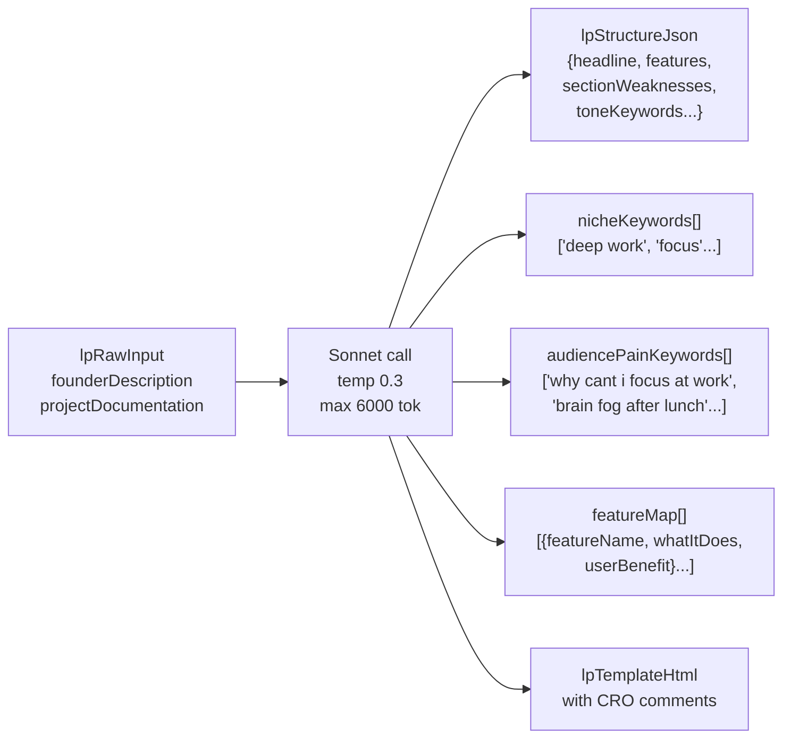

**Key rule:** `audiencePainKeywords` must be complaint-oriented search terms — what a frustrated user would type into YouTube, not topic labels.

---

### Stage 1.1 — Project Documentation (optional but recommended)

**Page:** `/admin/brand-clarity/[id]/docs`

User pastes full product docs (README, spec, feature list). If present, `bc-lp-parser.ts` is re-run and extracts an enriched `featureMap`. Without docs, `featureMap` is empty and the LP generator falls back to `lpStructureJson.features`.

**Status flow:** `draft` → `docs_pending` → `channels_pending`

---

### Stage 2 — Channel Discovery

**Script:** `scripts/bc-channel-discovery.ts`
**Model:** None (YouTube Data API only)
**Quota:** ~301 units per run

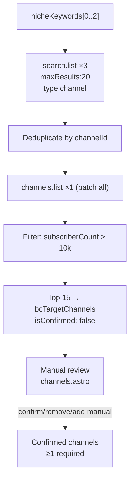

---

### Stage 3 — Video Discovery

**Script:** `scripts/bc-video-discovery.ts`
**Model:** None (YouTube Data API only)
**Quota:** ~200 units per channel (2 search.list + 1 videos.list batch)

#### v2 Enhancement: Dual Search Pass

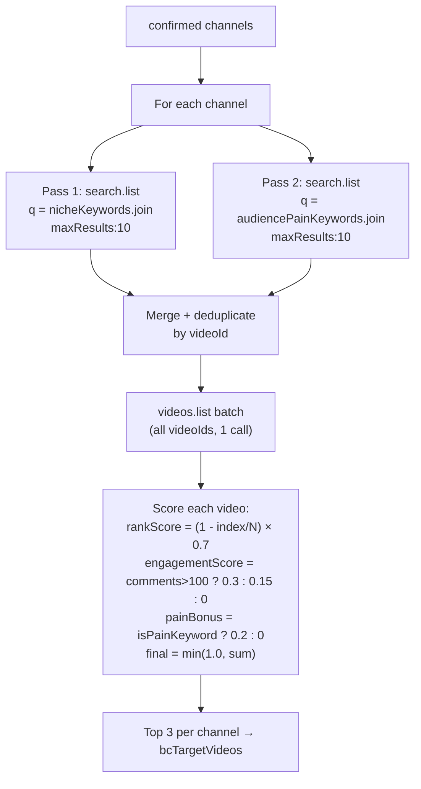

**Pain-keyword videos get +0.2 relevance bonus** because their comment sections are more likely to contain extractable VoC data — complaint-heavy discussions vs. passive topic videos.

---

### Stage 4 — Comment Scraping & Pain Point Extraction

**Script:** `scripts/bc-scraper.ts`
**Model:** Haiku (`BC_SCRAPER_MODEL`, ~300 calls per run)
**Quota:** ~2 YouTube API units per video (commentThreads pagination)

#### Comment Pipeline

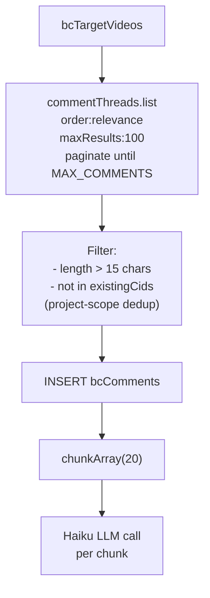

#### Haiku Extraction → `vocData`

Each chunk of 20 comments produces pain points. In v2, each pain point includes a structured `vocData` object:

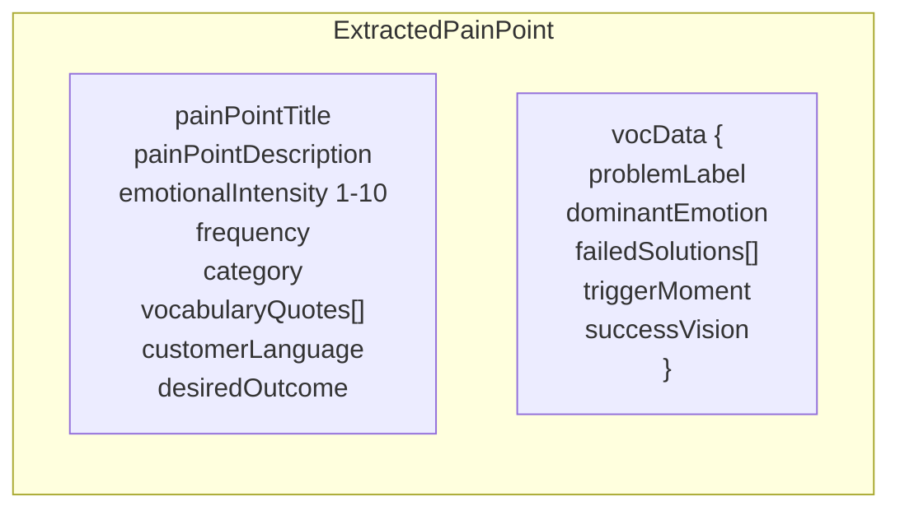

| `vocData` field | Example | LP usage |
|-----------------|---------|----------|
| `problemLabel` | `"brain fog after lunch"` | Hero headline — their words |
| `dominantEmotion` | `"frustration"` | Subheadline emotional tone |
| `failedSolutions` | `["pomodoro", "coffee", "naps"]` | Problem section: "You've tried X, Y, Z" |
| `triggerMoment` | `"right after a meeting when I need to code"` | Problem opener: "You know that moment when…" |
| `successVision` | `"just sit down and the code flows for 3 hours"` | CTA: "Give me X. Get [successVision]." |

#### v2 Post-Extraction Processing

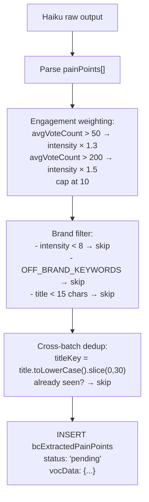

---

### Stage 4 Review — Pain Point Approval

**Page:** `/admin/brand-clarity/[id]/scrape`

Admin reviews extracted pain points via `BcPainPointCard`. Actions:
- **Approve** — marks `status: 'approved'`
- **Reject** — marks `status: 'rejected'`
- **Auto-filter** — bulk-rejects pending entries with `emotionalIntensity < 8`

**Requirement:** ≥3 approved pain points before clustering is available.

---

### Stage 4.5 — Pain Point Clustering (NEW in v2)

**Script:** `scripts/bc-pain-clusterer.ts`
**Model:** Sonnet (1 call)
**API:** `POST /api/brand-clarity/[projectId]/cluster-pain-points`

This is the synthesis step that was missing in v1. Instead of using individual pain points in the LP generator, Sonnet reads ALL approved pain points and groups them into 2-3 meaningful clusters.

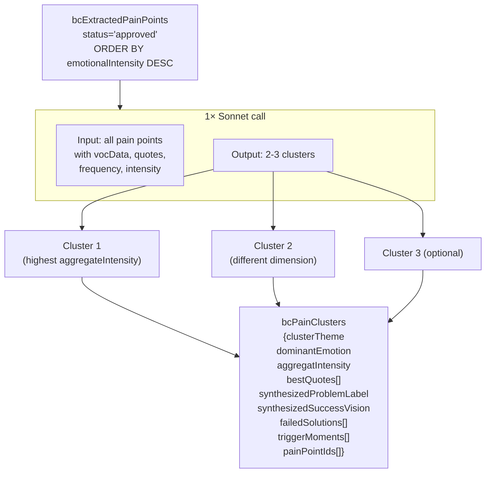

**Why clustering matters:**
- Individual pain points may repeat the same theme. Taking "top 2 by intensity" can give you 2 variants about the same problem.
- Clustering ensures Variant B and Variant C address **genuinely different customer dimensions**.
- Aggregate intensity (avg × frequency) is more robust than a single high-intensity comment.
- `synthesizedProblemLabel` and `synthesizedSuccessVision` are the most powerful VoC data for copy — synthesized from many voices, not one.

#### Cluster data structure

```
bcPainClusters {
  clusterTheme          — "Can't focus after meetings drain energy"
  dominantEmotion       — "frustration"
  aggregateIntensity    — 8.4
  synthesizedProblemLabel — "brain fog that kills my afternoons"
  synthesizedSuccessVision — "3 hours of flow after lunch, no coffee needed"
  bestQuotes            — ["I sit down to work and nothing comes out",
                           "meetings leave me useless for the rest of the day",
                           "I know what I need to do but I just can't start"]
  failedSolutions       — ["pomodoro", "coffee", "power naps", "phone away"]
  triggerMoments        — ["right after a 2-hour meeting",
                           "3pm energy crash", "after lunch"]
  painPointIds          — [3, 7, 12, 15]
}
```

---

### Stage 5 — LP Generation

**Script:** `scripts/bc-lp-generator.ts`
**Model:** Sonnet × 3 calls (`BC_LP_MODEL`)
**Trigger:** `POST /api/brand-clarity/[projectId]/generate-variants`

#### Input loading

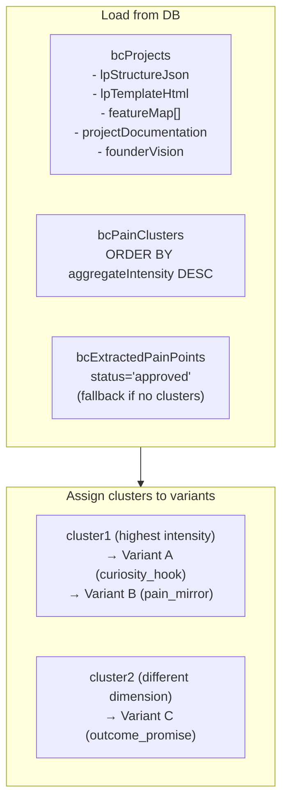

#### Three Variant Strategies

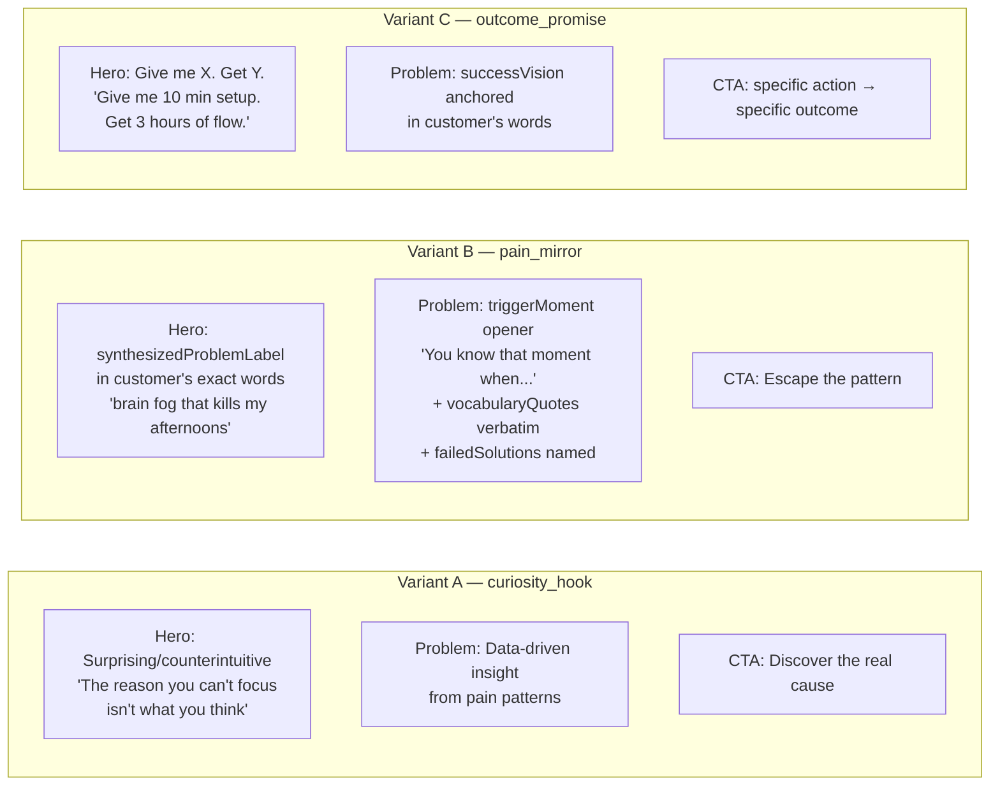

#### Shared requirements across all 3 variants

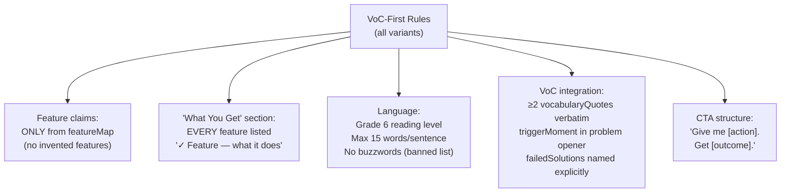

#### LP Generator prompt structure (per variant)

```
[system]
  VoC-first principle
  Language laws (Grade 6, banned words, 15-word sentences)

[user]
  PROJECT + VARIANT TYPE
  PRODUCT DOCUMENTATION (source of truth, 6000 chars)
  FEATURE MAP (only these features allowed)
  VOICE OF CUSTOMER DATA
    - clusterTheme
    - synthesizedProblemLabel
    - dominantEmotion
    - synthesizedSuccessVision
    - failedSolutions[]
    - triggerMoments[]
    - bestQuotes[] (verbatim — use these in copy)
  LP STRUCTURE (sectionOrder, brandVoice, primaryCTA)
  VARIANT-SPECIFIC HERO STRATEGY
  SECTION-BY-SECTION REQUIREMENTS
  OUTPUT FORMAT (meta JSON + HTML)
```

#### LLM Output parsing

```mermaid
flowchart TD
    RES["Sonnet response"] --> J["```json block"]
    RES --> H["```html block"]
    J --> M1["heroApproach"]
    J --> M2["featurePainMap[]\n{feature, painItSolves,\nvocQuote, section}"]
    J --> M3["improvementSuggestions\n{hero, problem, solution,\nfeatures, social_proof, cta}"]
    H --> HTML["Full LP HTML\n<section class='hero'>\n<section class='problem'>..."]
    M2 --> DB["bcLandingPageVariants\n.featurePainMap"]
    M3 --> DB2["bcLandingPageVariants\n.improvementSuggestions"]
    HTML --> DB3["bcLandingPageVariants\n.htmlContent"]
```

---

## 4. Data Flow: Voice of Customer Through the System

This diagram shows how a single customer quote travels from a YouTube comment to the final landing page headline.

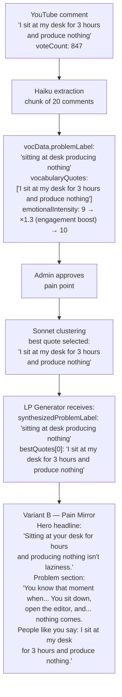

---

## 5. Admin UI Flow

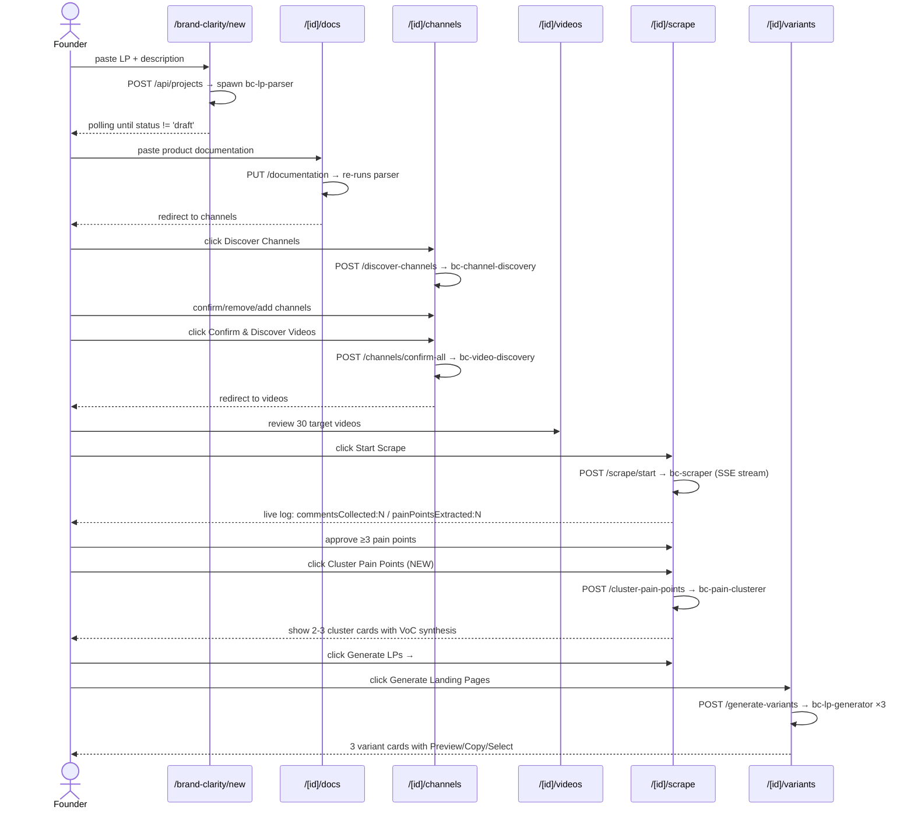

---

## 6. Database Schema (v2)

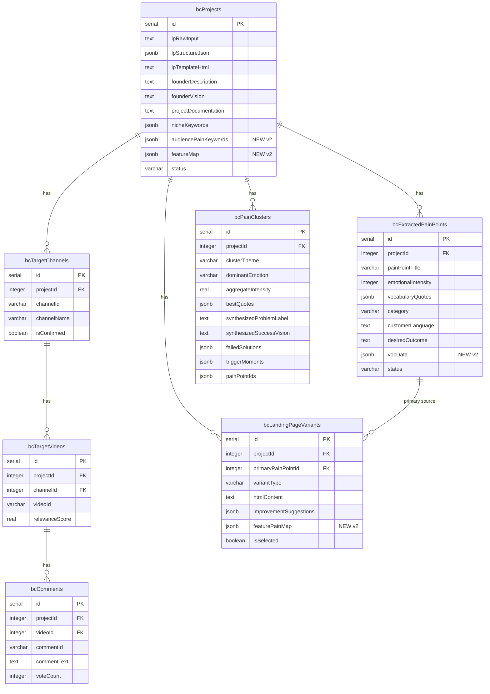

---

## 7. API Routes

```
POST   /api/brand-clarity/projects                          Create project + spawn parser
GET    /api/brand-clarity/projects                          List all projects
GET    /api/brand-clarity/projects/[id]                     Get project detail
PUT    /api/brand-clarity/projects/[id]                     Update fields
DELETE /api/brand-clarity/projects/[id]                     Delete + cascade
PUT    /api/brand-clarity/projects/[id]/documentation       Save docs → re-parse

POST   /api/brand-clarity/[id]/discover-channels            Spawn bc-channel-discovery
GET    /api/brand-clarity/[id]/channels                     List channels
POST   /api/brand-clarity/[id]/channels                     Add manually
PUT    /api/brand-clarity/[id]/channels/[cid]               Update isConfirmed/sortOrder
DELETE /api/brand-clarity/[id]/channels/[cid]               Remove
POST   /api/brand-clarity/[id]/channels/confirm-all         Confirm + spawn video discovery

POST   /api/brand-clarity/[id]/discover-videos              (Re-)trigger video discovery
GET    /api/brand-clarity/[id]/videos                       List target videos

POST   /api/brand-clarity/[id]/scrape/start                 Spawn bc-scraper
GET    /api/brand-clarity/[id]/scrape/status                Poll job state
GET    /api/brand-clarity/[id]/scrape/stream                SSE live log

GET    /api/brand-clarity/[id]/pain-points                  List (filter: status, category)
PUT    /api/brand-clarity/[id]/pain-points/[pid]            Approve / reject
DELETE /api/brand-clarity/[id]/pain-points/[pid]            Delete
POST   /api/brand-clarity/[id]/pain-points/auto-filter      Bulk reject intensity < 8

POST   /api/brand-clarity/[id]/cluster-pain-points          NEW — spawn bc-pain-clusterer
GET    /api/brand-clarity/[id]/cluster-pain-points          NEW — list existing clusters

POST   /api/brand-clarity/[id]/generate-variants            Spawn bc-lp-generator × 3
GET    /api/brand-clarity/[id]/variants                     List variants (no htmlContent)
GET    /api/brand-clarity/[id]/variants/[vid]               Get variant + htmlContent
PUT    /api/brand-clarity/[id]/variants/[vid]               Update isSelected / htmlContent
DELETE /api/brand-clarity/[id]/variants/[vid]               Delete
```

---

## 8. Project Status State Machine

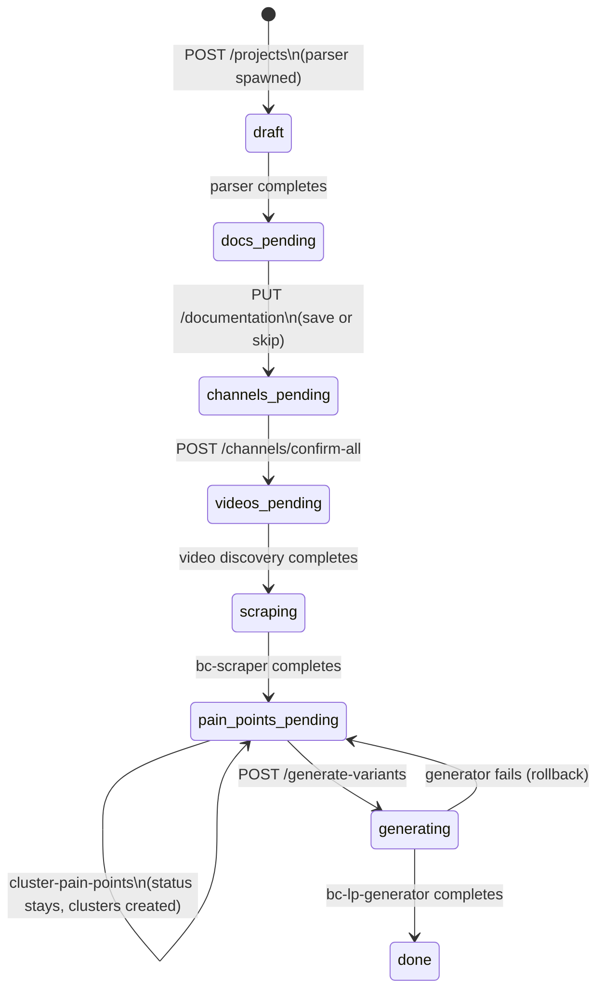

---

## 9. LLM Cost Per Full Run

| Operation | Script | Model | Calls | Estimated cost |
|-----------|--------|-------|-------|----------------|
| LP parsing + keyword extraction | bc-lp-parser | Sonnet | 1 | ~$0.02 |
| Pain point extraction | bc-scraper | Haiku | ~300 | ~$0.10 |
| Pain point clustering | bc-pain-clusterer | Sonnet | 1 | ~$0.02 |
| LP variant generation | bc-lp-generator | Sonnet | 3 | ~$0.08 |
| **Total** | | | **~305** | **~$0.22** |

YouTube API quota per run: ~2,362 units (with dual video search pass). Max ~4 full runs/day before 10k quota limit.

---

## 10. Scripts Reference

| Script | Model | Input env | Output |
|--------|-------|-----------|--------|
| `bc-lp-parser.ts` | Sonnet | `BC_PROJECT_ID` | `lpStructureJson`, `nicheKeywords`, `audiencePainKeywords`, `featureMap` → `LP_PARSE_RESULT:{...}` |
| `bc-channel-discovery.ts` | None | `BC_PROJECT_ID`, `YOUTUBE_API_KEY` | `bcTargetChannels` → `CHANNELS_FOUND:N` |
| `bc-video-discovery.ts` | None | `BC_PROJECT_ID`, `YOUTUBE_API_KEY` | `bcTargetVideos` → `VIDEOS_FOUND:N` |
| `bc-scraper.ts` | Haiku | `BC_PROJECT_ID`, `YOUTUBE_API_KEY`, `BC_SCRAPER_MODEL`, `BC_MAX_COMMENTS_PER_VIDEO`, `BC_CHUNK_SIZE` | `bcComments`, `bcExtractedPainPoints` → `commentsCollected:N`, `painPointsExtracted:N`, `RESULT_JSON:{...}` |
| `bc-pain-clusterer.ts` | Sonnet | `BC_PROJECT_ID` | `bcPainClusters` → `CLUSTERS_CREATED:N` |
| `bc-lp-generator.ts` | Sonnet | `BC_PROJECT_ID`, `BC_LP_MODEL` | `bcLandingPageVariants` ×3 → `VARIANTS_GENERATED:N` |

---

## 11. Success Criteria for Generated LPs

After full run, each LP variant should pass:

1. **Hero test** — reads headline and either: "wait, what?" (curiosity) / "that's my problem" (pain mirror) / "I want that" (outcome promise)
2. **VoC test** — at least 5 vocabulary quotes from real comments appear verbatim
3. **Specificity test** — beta tester can list exactly what features they get
4. **Simplicity test** — every sentence ≤15 words, Grade 6 reading level
5. **Grounding test** — every feature mentioned exists in `featureMap` (from docs)
6. **CTA test** — primary CTA follows "Give me X. Get Y." structure
7. **No-bullshit test** — zero banned buzzwords appear in output
